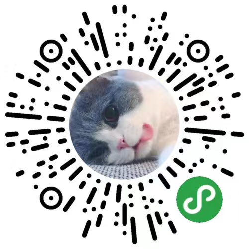
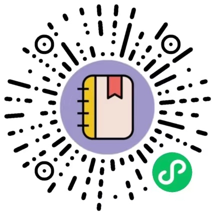

# Cretin，Be Strong ~

| 公众号   | 掘金     |  CSDN   |   简书   | 个人博客 |
|---------|---------|--------- |--------- |---------|
| [Cretin的开发之路](https://github.com/MZCretin/MZCretin/blob/master/resource/cretin.jpg) | [点我](https://juejin.im/user/5838d57fac502e006c1708bc) | [点我](https://blog.csdn.net/u010998327) | [点我](https://www.jianshu.com/u/123f97613b86)  | [点我](http://blog.mxnzp.com/) |

### 个人主页

+ **[https://www.mxnzp.com](https://www.mxnzp.com)**

### 最受欢迎的项目

+ 通用免费API：**[https://github.com/MZCretin/RollToolsApi](https://github.com/MZCretin/RollToolsApi)**
+ 段子乐APP开放API：**https://github.com/MZCretin/duanzile-open-api**

### 个人开发运营的Android App

+ **[《段子乐》](https://www.pgyer.com/rmjK)** 
+ **[《傻瓜记账》](https://www.pgyer.com/C9ZX)**

### 个人开发运营的小程序
+ **Roll地盘**

  

    
  

  
+ **宝宝每日记录**

  

    
  

+ **我有小家**

  

    
  

+ **阿萍TXT**

  

    
  

+ **记事萍**

  

    
  

